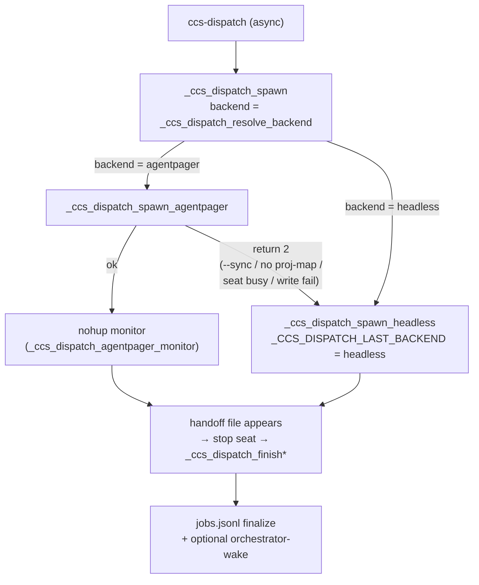

# Dispatch orchestration — architecture invariants

> **Why this exists:** the dispatch subsystem (`ccs-dispatch.sh`) has
> load-bearing rules that only emerge from tracing across functions — how
> `auto` picks a backend, why "resolve chose agent-pager" does not mean
> "the worker ran on agent-pager", when the orchestrator gets woken. These
> live in code + gitignored handoffs, so a reader (or agent) asking "how
> does dispatch decide X?" had nowhere to look. This doc is the committed,
> dev-facing answer.
>
> **When to read:** before changing backend selection
> (`_ccs_dispatch_resolve_backend` / `_ccs_dispatch_agentpager_available` /
> `_ccs_dispatch_spawn*`), the gate loop, the chain driver, the async
> monitor / finalize, or the orchestrator-wake path. Behaviour of flags and
> file interfaces is defined by the code; this doc records the invariants
> and cites the functions. Line numbers drift — anchors are **function
> names**, not lines.
>
> **Scope:** the `ccs-dispatch` / `ccs-dispatch-run` orchestration only.
> Module layout (which `ccs-*.sh` owns which command) is in the
> user-facing [`docs/architecture.md`](../architecture.md); per-command
> reference is in [`docs/commands.md`](../commands.md).

## 1. Two dispatch entry points

There are two distinct dispatch paths, and their backend behaviour differs.
Confusing them is the most common source of misjudgement.

| Entry | Function | Nature | Backend source | Falls back to headless? |
|---|---|---|---|---|
| `ccs-dispatch` | `_ccs_dispatch_spawn` | fire-and-forget job (job board) | `CCS_DISPATCH_BACKEND` (auto default) | **Yes** — spawn-layer, 4 triggers (I3) |
| `ccs-dispatch-run` | `_ccs_dispatch_run` → `_ccs_dispatch_run_one` | synchronous gate loop (+ chain) | `backend:` field in `task.yaml` (default `headless`) | **No** — explicit request honoured (I5) |

The **async job path** auto-resolves a backend and may silently fall back.
The **gate path** takes an explicit per-task backend and never falls back —
the gate is autonomous, so an explicit request is honoured or the run fails.

## 2. Backend selection — the two-layer model

`auto` is resolved in one function and can be **overridden by reality** in
another. Both layers matter.

### Layer 1 — resolve (`_ccs_dispatch_resolve_backend`)

`CCS_DISPATCH_BACKEND` is `auto` (default) | `agentpager` | `headless`.
Under `auto`, the backend is `agentpager` iff
`_ccs_dispatch_agentpager_available` returns 0, else `headless`. Any
unrecognised value resolves to `headless`.

`_ccs_dispatch_agentpager_available` is a strict AND-chain (any failure →
`headless`), in order:

1. `systemctl` exists on `PATH`.
2. `agent-pager.service` (user unit) is active (`systemctl --user is-active`).
3. `${AGENT_PAGER_DIR:-$HOME/.agent-pager}` exists.
4. `${AGENT_PAGER_DIR}/inbound/` exists.
5. **Hybrid Detection (design Decision A)** on spool ownership:
   - **same-uid** — the spool dir is owned by the caller (personal
     workflow, the common case): trust it, **skip** the group / setgid
     checks. Passes here.
   - **cross-uid** — the spool is owned by another user (shared seat):
     enforce the strict checks — the caller must be in the `claude-broker`
     group **and** the `inbound/` dir must carry that group (setgid
     evidence). Both required, else `headless`.

So on your own machine (same-uid), `auto` selects `agentpager` from just
three facts: daemon active + `~/.agent-pager/inbound/` present + spool is
yours. The group/setgid gate is a shared-seat-only concern.

### Layer 2 — spawn (`_ccs_dispatch_spawn_agentpager`)

Resolving to `agentpager` does **not** guarantee the worker runs on
agent-pager. `_ccs_dispatch_spawn` tries `_ccs_dispatch_spawn_agentpager`
first and, on `return 2`, falls through to `_ccs_dispatch_spawn_headless`,
recording the **actual** backend in `_CCS_DISPATCH_LAST_BACKEND`. The
finalize/preview surfaces read that variable, not the resolved intent.

This is why the operator preview prints "(falls back to headless if the
seat is unavailable)" and why the orchestrator-wake case-b handling must
cover "resolved agentpager but fell back" — see I2 / I3.

## 3. Critical invariants

Each: **Rule / Why / Test backstop / Cite**.

### I1. Backend Hybrid Detection is ownership-branched (Decision A)

**Rule:** `_ccs_dispatch_agentpager_available` must keep the same-uid short
circuit (`stat -c %u "$pager_dir" == id -u` → pass) ahead of the cross-uid
`claude-broker` group + `inbound/` setgid checks. Do not collapse to a
single always-strict path, and do not drop the group/setgid path.

**Why:** the personal workflow owns its own spool and has full access, so
demanding a `claude-broker` group there would break the common case for no
security gain. The strict checks exist only to make a *shared* seat safe
(a caller must prove group membership + setgid provenance). Both halves are
load-bearing for their respective deployment.

**Test backstop:** `tests/test-dispatch-backend.sh` (resolve + availability
branches).

**Cite:** `_ccs_dispatch_agentpager_available`, `_ccs_dispatch_resolve_backend`
in `ccs-dispatch.sh`; multi-provider backend rationale in
[`docs/adr/002-unified-multi-provider-architecture.md`](../adr/002-unified-multi-provider-architecture.md).

### I2. Resolved backend ≠ effective backend

**Rule:** the resolved backend (`_ccs_dispatch_resolve_backend`) is an
*intent*. The effective backend is whatever `_ccs_dispatch_spawn` actually
spawned, tracked in `_CCS_DISPATCH_LAST_BACKEND`. Any code that needs to
know how the worker actually ran (finalize records, preview, wake routing)
must read `_CCS_DISPATCH_LAST_BACKEND`, never re-derive from
`CCS_DISPATCH_BACKEND` / resolve.

**Why:** `_ccs_dispatch_spawn_agentpager` can `return 2` after resolve
already chose `agentpager`; the dispatcher then falls back to headless. A
consumer that trusts the resolved intent will mislabel the job's backend
and, for wake, mis-route (an agent-pager wake to a session that actually
ran headless, or vice-versa).

**Test backstop:** `tests/test-dispatch-spawn-agentpager.sh` (fallback sets
last-backend), `tests/test-dispatch-backend.sh`.

**Cite:** `_ccs_dispatch_spawn`, `_CCS_DISPATCH_LAST_BACKEND` in
`ccs-dispatch.sh`.

### I3. agent-pager spawn falls back to headless on exactly four triggers

**Rule:** `_ccs_dispatch_spawn_agentpager` returns 2 (→ headless) on, and
only on:

1. `--sync` mode — the agent-pager backend is async-only.
2. No `proj-map` entry for the project dir
   (`CCS_DISPATCH_PROJ_MAP` / `~/.config/ccs-dashboard/proj-map`).
3. The single per-user seat (`agent-pager-local-<user>` tmux session) is
   already alive — one interactive worker per user; a second would share
   the same session + `out.stream` and corrupt both. Multi-worker is v2.
4. Writing the agent-pager inbound launch file failed.

Adding a new hard-failure path here must return 2 (fall back), not abort
the dispatch.

**Why:** the async agent-pager worker is a scarce, stateful resource (one
tmux seat, one stream). When it is unavailable or inapplicable, headless is
the always-available path that still completes the job. Aborting instead of
falling back would make `auto` less reliable than plain headless.

**Test backstop:** `tests/test-dispatch-spawn-agentpager.sh`,
`tests/test-dispatch-proj.sh` (proj-map resolution).

**Cite:** `_ccs_dispatch_spawn_agentpager`,
`_ccs_dispatch_resolve_proj_from_dir`,
`_ccs_dispatch_agentpager_session_alive` in `ccs-dispatch.sh`.

### I4. The gate is the sole verdict source; backend changes only HOW the worker spawns

**Rule:** the deterministic Stage-1 gate (`_ccs_dispatch_gate_run`) is the
only thing that decides PASS / RETRY / ESCALATE / HARD_STOP. The `backend:`
choice (headless vs agentpager) changes only how the worker process is
launched, never the verdict, evidence layout, or retry logic.

**Why:** the gate re-runs every `verify.cmd` against ground truth, which is
what catches an auto-approved false success (a headless `claude -p
--permission-mode bypassPermissions` or `gemini --approval-mode yolo`
worker that confabulates completion). If the backend could influence the
verdict, that guarantee would leak. For the same reason every task must
carry at least one `cmd`-track AC — each AC declares exactly one of
`verify.cmd` / `verify.guidance`, and an all-`guidance` task is rejected
at load (`_ccs_dispatch_gate_load_task`).

**Test backstop:** `tests/test-gate-verdict.sh`, `tests/test-gate-run.sh`,
`tests/test-gate-loop.sh`, `tests/test-gate-ac.sh`.

**Cite:** `_ccs_dispatch_gate_run`, `_ccs_dispatch_gate_verdict`,
`_ccs_dispatch_gate_load_task` (AC validation) in `ccs-dispatch.sh`;
confabulation root-cause in
[`docs/case-studies/2026-06-23-opus-fabricated-output.md`](../case-studies/2026-06-23-opus-fabricated-output.md).

### I5. The gate path takes an explicit backend and never falls back

**Rule:** the gate-loop worker (`_ccs_dispatch_run_worker`, agentpager
branch) uses the task's explicit `backend:` and must NOT fall back to
headless. Contrast I3 (the async path falls back). An explicit
`backend: agentpager` in a task is honoured or the run fails.

**Why:** the gate path is autonomous (no operator watching to notice a
silent downgrade). A task that declared `agentpager` did so to get a
monitorable/interruptible tmux worker; silently running it headless would
defeat that intent without anyone noticing. The async job path is different
— an operator signs off the dispatch and sees the "fell back" note.

**Test backstop:** `tests/test-gate-agentpager.sh`,
`tests/test-dispatch-agentpager-cli.sh`.

**Cite:** `_ccs_dispatch_run_worker` (agentpager branch),
`_ccs_dispatch_run_worker_agentpager` in `ccs-dispatch.sh`.

### I6. Chains advance only on PASS, and only the terminal hop wakes

**Rule:** `_ccs_dispatch_run` follows a task's `next:` only after a PASS
verdict. The chain stops on non-PASS, empty-`next` (complete), max depth
(`CCS_DISPATCH_CHAIN_MAX_DEPTH`, default 5), a cycle, or a next-load
failure (`_ccs_dispatch_chain_stop_reason`). A mid-chain hop must not fire
an orchestrator-wake; only the terminal hop does.

**Why:** intermediate hops are machine-to-machine handoffs the orchestrator
should not surface as turns (context economy — the board carries the
pointer, evidence stays on disk). Waking on every hop would flood the
orchestrator with intermediate state.

**Test backstop:** `tests/test-dispatch-chain.sh`,
`tests/test-gate-chain-loop.sh`, `tests/test-gate-chain-guards.sh`.

**Cite:** `_ccs_dispatch_run`, `_ccs_dispatch_chain_stop_reason`,
`_ccs_dispatch_resolve_next` in `ccs-dispatch.sh`.

### I7. Orchestrator-wake = pager-orchestrator AND agentpager-backend (else pull)

**Rule:** a completed async job wakes the dispatching orchestrator only
when **both**: (a) the dispatching session was itself pager-launched (a
resolvable wake slot exists) **and** (b) the worker ran on the agentpager
backend. Otherwise there is no push channel and the orchestrator relies on
`ccs-jobs` pull. Wake is fire-and-forget (never fails the caller, does not
depend on delivery ack) and opts out with `CCS_DISPATCH_WAKE=0`. A
non-chain job wakes on finalize regardless of terminal status; a chain
wakes only at the terminal hop (I6).

**Why:** the wake mechanism reuses agent-pager's `do_input` relay, which
needs a target slot; a local-terminal/headless dispatcher has no slot to
target. Coupling wake to the agentpager backend keeps the AND explicit
rather than firing blind writes.

**Test backstop:** `tests/test-dispatch-wake.sh`.

**Cite:** `_ccs_dispatch_resolve_wake_slot`, `_ccs_dispatch_wake_fire`,
`_ccs_dispatch_agentpager_wake_file` in `ccs-dispatch.sh`; GitHub issues
#91 / #93.

### I8. Worker completion is a handoff file; the attended backend has no wall-clock kill

**Rule:** the async agent-pager worker signals completion by writing
`tmp/handoff-<job_id>.md` (design Decision B); the monitor
(`_ccs_dispatch_agentpager_monitor`) polls for that file, then stops the
seat and finalizes. There is deliberately **no** wall-clock kill on the
attended job path (design D2) — a stuck worker stays up for the operator to
`/stop`. (The autonomous gate path IS bounded by a timeout, a different
entry point — see I5.)

**Why:** the attended worker runs in a monitorable tmux seat; killing it on
a timer would destroy operator-inspectable state mid-task. The job path
trades automatic reaping for operator control; the gate path, being
autonomous, takes the opposite trade.

**Test backstop:** `tests/test-jobs-agentpager.sh`,
`tests/test-handoff.sh`.

**Cite:** `_ccs_dispatch_agentpager_monitor`, `_ccs_dispatch_agentpager_prompt`
(handoff-gating rule), `_ccs_dispatch_finish` in `ccs-dispatch.sh`.

## 4. Maintenance

Adding an invariant:

1. Add a § 3 entry: **Rule / Why / Test backstop / Cite** (cite function
   names + `tests/test-*.sh`, not line numbers).
2. Add / point to a test backstop where the rule is mechanically checkable.
3. Keep cites pointing at **committed** artifacts (code, `docs/`, GitHub
   issues). Do NOT cite `internal/` design docs — they are gitignored and
   are dangling references for anyone reading this public repo.
4. This repo is **public**: no personal paths, no internal hostnames/IPs,
   no credentials in this file.

### Ruled-out (do not re-propose)

- **Wall-clock kill on the attended job path** — deliberately absent (D2);
  operator `/stop` reclaims a stuck seat (I8).
- **Multi-worker per user on the agent-pager seat** — the single seat is a
  v1 constraint; a second concurrent worker would corrupt the shared
  `out.stream` (I3 trigger 3). Multi-worker is a v2 design, not a bug.
- **Backend influencing the gate verdict** — the gate must stay the sole,
  backend-independent verdict source (I4).
